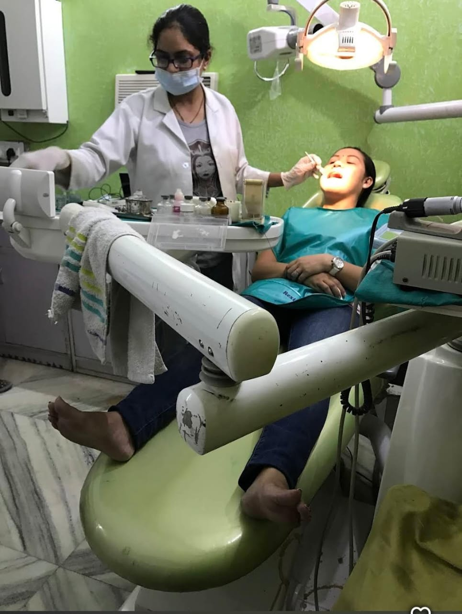

<div align="center">


# 🏥 Prarthna Multispeciality Clinic

### Complete Dental & Health Care · Tigri Colony, Delhi & Faridabad

[](https://prarthna-clinic-web.vercel.app)
[](https://nextjs.org)
[](https://spring.io/projects/spring-boot)
[](https://postgresql.org)
[](https://docker.com)

*Trusted healthcare since 2011 · 5000+ patients treated · 15+ years of compassionate care*

</div>

---

## 📁 Project Structure

```
prarthna-clinic/
├── frontend/          # Next.js 14 + Tailwind CSS + TypeScript
├── backend/           # Spring Boot 3 + Java 17 + PostgreSQL + JWT
└── README.md
```

---

## 👨‍⚕️ Meet the Doctors

<table>
<tr>
<td align="center" width="50%">


### Dr. Paritosh Mishra
**MBBS · Senior Physician & Founder**

⭐ 4.9 · 872 reviews · 2000+ patients · 20 yrs exp
💰 Consultation: ₹500

*General Medicine, Diabetes, Hypertension*

</td>
<td align="center" width="50%">


### Dr. Rajni Mishra
**BDS · Dental Specialist**

⭐ 4.8 · 272 reviews · 1500+ patients · 15 yrs exp
💰 Consultation: ₹400

*Cosmetic Dentistry, Root Canal, Orthodontics*

</td>
</tr>
</table>

<div align="center">

<br/><br/>

</div>

---

## 🚀 Quick Start

### Prerequisites
- Node.js 18+
- Java 17+
- Maven 3.9+
- PostgreSQL 14+ (or use H2 in-memory for dev)

---

## 🖥️ Frontend Setup (Next.js)

```bash
cd frontend

# Install dependencies
npm install

# Copy env file
cp .env.local.example .env.local
# Edit .env.local → set NEXT_PUBLIC_API_URL=http://localhost:8081

# Run dev server
npm run dev
```

Runs at → **http://localhost:3000**

### Build for production
```bash
npm run build
npm start
```

---

## ⚙️ Backend Setup (Spring Boot)

### Option A — PostgreSQL (recommended)

**1. Create database**
```sql
CREATE DATABASE prarthnadb;
```

**2. Set environment variables** (or edit `application.properties`):
```bash
export SPRING_DATASOURCE_URL=jdbc:postgresql://localhost:5432/prarthnadb
export SPRING_DATASOURCE_USERNAME=postgres
export SPRING_DATASOURCE_PASSWORD=yourpassword
export JWT_SECRET=your-secret-key-minimum-32-characters-long
export CORS_ALLOWED_ORIGINS=http://localhost:3000
```

**3. Run the application**
```bash
cd backend
mvn spring-boot:run
```

Runs at → **http://localhost:8081**

---

### Option B — H2 In-Memory (no database needed, dev only)

Uncomment the H2 block and comment out the PostgreSQL block in `backend/src/main/resources/application.properties`:

```properties
# H2 (dev)
spring.datasource.url=jdbc:h2:mem:prarthnadb;DB_CLOSE_DELAY=-1;NON_KEYWORDS=DAY,VALUE,TIME
spring.datasource.driver-class-name=org.h2.Driver
spring.datasource.username=sa
spring.datasource.password=
spring.jpa.hibernate.ddl-auto=create
spring.h2.console.enabled=true
spring.h2.console.path=/h2-console

# Comment out PostgreSQL lines when using H2
# spring.datasource.url=${SPRING_DATASOURCE_URL}
# spring.datasource.username=${SPRING_DATASOURCE_USERNAME}
# spring.datasource.password=${SPRING_DATASOURCE_PASSWORD}
```

---

### Option C — Docker

```bash
cd backend
docker build -t prarthna-clinic-backend .

docker run -p 8081:8080 \
  -e SPRING_DATASOURCE_URL=jdbc:postgresql://host.docker.internal:5432/prarthnadb \
  -e SPRING_DATASOURCE_USERNAME=postgres \
  -e SPRING_DATASOURCE_PASSWORD=yourpassword \
  -e JWT_SECRET=your-secret-key-minimum-32-characters-long \
  -e CORS_ALLOWED_ORIGINS=http://localhost:3000 \
  prarthna-clinic-backend
```

---

## 🔑 Default Credentials (seeded on first run)

| Role   | Email                     | Password   |
|--------|---------------------------|------------|
| Admin  | admin@prartnaclinic.in    | Admin@123  |
| Doctor | parit1605@gmail.com       | Doctor@123 |
| Doctor | rajni@prartnaclinic.in    | Doctor@123 |

> **Note:** `DataSeeder` runs automatically on first startup and creates the admin account plus both doctors with approved status and full time slots (Mon–Sat 11AM–7PM, Sun 11AM–2PM). No manual DB inserts needed.

---

## 🌐 Pages (Frontend)

| Route                | Description                                       | Auth Required |
|----------------------|---------------------------------------------------|---------------|
| `/`                  | Home — hero, services, doctors, FAQ, testimonials | No            |
| `/doctors`           | All approved doctors listing                      | No            |
| `/doctors/[id]`      | Doctor profile with reviews & time slots          | No            |
| `/services`          | All medical & dental services                     | No            |
| `/about`             | Clinic story, values, team                        | No            |
| `/contact`           | Contact form, addresses, phone, hours             | No            |
| `/booking`           | Book an appointment                               | Patient/Admin |
| `/login`             | Login page (all roles)                            | No            |
| `/register`          | New account registration                          | No            |
| `/patient/dashboard` | View & cancel own appointments                    | Patient       |
| `/doctor/dashboard`  | Manage incoming bookings                          | Doctor        |
| `/doctor/profile`    | Edit profile & time slots                         | Doctor        |
| `/admin`             | Admin dashboard — users, doctors, bookings, stats | Admin         |

---

## 📡 API Endpoints

All responses follow the envelope:
```json
{ "success": true, "message": "...", "data": { ... } }
```

### Auth — Public

| Method | Endpoint             | Body                                   | Description        |
|--------|----------------------|----------------------------------------|--------------------|
| POST   | `/api/auth/register` | `{name, email, password, phone, role}` | Register user      |
| POST   | `/api/auth/login`    | `{email, password}`                    | Login, returns JWT |

### Doctors — Public

| Method | Endpoint                    | Query Params             | Description             |
|--------|-----------------------------|--------------------------|-------------------------|
| GET    | `/api/doctors`              | `?specialization=&search=` | All approved doctors  |
| GET    | `/api/doctors/{id}`         | —                        | Doctor detail + reviews |
| GET    | `/api/doctors/{id}/reviews` | —                        | Doctor's reviews        |

### Doctors — Protected

| Method | Endpoint                    | Role           | Description            |
|--------|-----------------------------|----------------|------------------------|
| PUT    | `/api/doctors/{id}`         | DOCTOR / ADMIN | Update profile + slots |
| POST   | `/api/doctors/{id}/reviews` | PATIENT        | Submit review          |
| DELETE | `/api/doctors/reviews/{id}` | Authenticated  | Delete own review      |

### Bookings — Authenticated

| Method | Endpoint                     | Role     | Description       |
|--------|------------------------------|----------|-------------------|
| POST   | `/api/bookings`              | Patient  | Create booking    |
| GET    | `/api/bookings/my`           | Patient  | My bookings       |
| GET    | `/api/bookings/doctor`       | Doctor   | Incoming bookings |
| PATCH  | `/api/bookings/{id}/approve` | Doctor   | Approve booking   |
| PATCH  | `/api/bookings/{id}/cancel`  | Any auth | Cancel booking    |

### Users — Authenticated

| Method | Endpoint             | Description       |
|--------|----------------------|-------------------|
| GET    | `/api/users/profile` | Get my profile    |
| PUT    | `/api/users/profile` | Update my profile |

### Admin — ADMIN only

| Method | Endpoint                          | Description                              |
|--------|-----------------------------------|------------------------------------------|
| GET    | `/api/admin/doctors`              | All doctors (any status)                 |
| PATCH  | `/api/admin/doctors/{id}/approve` | Approve doctor                           |
| PATCH  | `/api/admin/doctors/{id}/reject`  | Reject doctor                            |
| GET    | `/api/admin/users`                | All registered users                     |
| GET    | `/api/admin/bookings`             | All bookings                             |
| GET    | `/api/admin/stats`                | `{totalUsers, totalDoctors, totalBookings}` |

---

## 🖼️ Images

Place photos in `frontend/public/images/`:

```
frontend/public/images/
├── logo.png              ← Clinic logo
├── dr-paritosh.jpg       ← Dr. Paritosh Mishra photo
├── dr-rajni.jpg          ← Dr. Rajni Mishra photo
├── doctors-together.jpg  ← Both doctors together
└── dental-care.jpg       ← Dental service photo
```

---

## 🛠️ Tech Stack

| Layer      | Technology                                              |
|------------|---------------------------------------------------------|
| Frontend   | Next.js 14, React 18, TypeScript, Tailwind CSS         |
| UI         | Radix UI, Framer Motion, lucide-react, react-hot-toast |
| Forms      | React Hook Form, Zod                                    |
| HTTP       | Axios (with JWT interceptor + 401 auto-redirect)        |
| Backend    | Spring Boot 3.2, Java 17, Spring Security              |
| Database   | PostgreSQL 16 (H2 for dev/test)                        |
| Auth       | JWT (jjwt 0.12.5), BCrypt                              |
| ORM        | Spring Data JPA / Hibernate                             |
| Validation | Jakarta Bean Validation                                 |
| Images     | Cloudinary (optional), AWS S3                           |
| Container  | Docker (multistage — Maven build → JRE Alpine)         |

---

## 🚢 Deployment

### Frontend → Vercel

```bash
# Push to GitHub, connect repo at vercel.com
# Set environment variable:
# NEXT_PUBLIC_API_URL=https://your-backend-url.com
```

### Backend → Railway / Render / AWS

```bash
cd backend
mvn clean package -DskipTests
# JAR lives at: target/clinic-backend-1.0.0.jar
java -jar target/clinic-backend-1.0.0.jar
```

Or use Docker (see Option C above). Set these env vars in your hosting provider:

```env
SPRING_DATASOURCE_URL=jdbc:postgresql://<host>:<port>/<dbname>
SPRING_DATASOURCE_USERNAME=<username>
SPRING_DATASOURCE_PASSWORD=<password>
JWT_SECRET=<your-long-random-secret-min-32-chars>
CORS_ALLOWED_ORIGINS=https://prarthna-clinic-web.vercel.app
PORT=8080
```

---

## 🔐 Security Notes

> **⚠️ Important for all contributors**

- **Never commit `.pem` files.** The root `.gitignore` includes `*.pem`. If you need an SSH key to access a server, store it in `~/.ssh/` — never inside the project folder.
- **JWT secret** has a fallback hardcoded for local dev. Always set `JWT_SECRET` as an environment variable in production and never rely on the default.
- **Admin self-registration** — the `/api/auth/register` endpoint accepts `role=admin`. Do not expose this endpoint publicly without additional protection.

```bash
# Safe way to store SSH keys — never in the project directory
mv prarthnaClinic.pem ~/.ssh/
chmod 400 ~/.ssh/prarthnaClinic.pem
ssh -i ~/.ssh/prarthnaClinic.pem ec2-user@your-server-ip
```

---

## 🌍 Environment Variables

### Backend

| Variable                     | Description                       | Default                                   |
|------------------------------|-----------------------------------|-------------------------------------------|
| `SPRING_DATASOURCE_URL`      | PostgreSQL JDBC URL               | — (required in prod)                      |
| `SPRING_DATASOURCE_USERNAME` | DB username                       | — (required in prod)                      |
| `SPRING_DATASOURCE_PASSWORD` | DB password                       | — (required in prod)                      |
| `JWT_SECRET`                 | Signing secret (min 32 chars)     | Fallback key (**change in prod!**)        |
| `PORT`                       | Server port                       | `8081`                                    |
| `CORS_ALLOWED_ORIGINS`       | Comma-separated allowed origins   | `https://prarthna-clinic-web.vercel.app`  |
| `LOG_LEVEL`                  | Log level for `com.prarthna`      | `DEBUG`                                   |

### Frontend (`.env.local`)

| Variable              | Description          | Default                 |
|-----------------------|----------------------|-------------------------|
| `NEXT_PUBLIC_API_URL` | Backend API base URL | `http://localhost:8080` |

---

## ⚠️ Known Issues

- **Time slots** in the booking form are hardcoded on the frontend. The `/api/doctors/{id}/slots` endpoint exists in `api.ts` but is unused — time slots should be fetched from the doctor's actual records.
- **`userAPI.update`** sends `multipart/form-data` but the backend controller expects JSON `@RequestBody`. These need to be aligned.
- **No payment integration** — `isPaid` and `ticketPrice` fields exist as placeholders for a future Razorpay integration.
- **Email notifications** — Spring Mail dependency is included but disabled. Configure SMTP to send booking confirmation emails.

---

## 📞 Clinic Info

| | |
|---|---|
| **Tigri Colony** | G-1916, Mehrauli Badarpur Road, Tigri Colony, Sangam Vihar, New Delhi – 110080 |
| **Faridabad** | Sun Rise Hospital, Sector 15, Faridabad – 121007 |
| **Timings** | Mon–Sat 11AM–7PM · Sunday 11AM–2PM |
| **Phone** | +91-9599752226 |
| **Email** | parit1605@gmail.com |

---

<div align="center">

*Built with ❤️ for Prarthna Multispeciality Clinic*

*Serving Delhi NCR families since 2011*

</div>